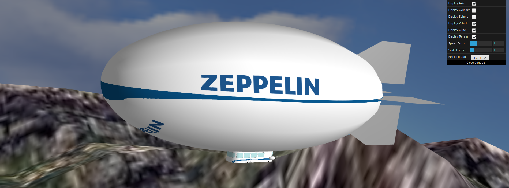
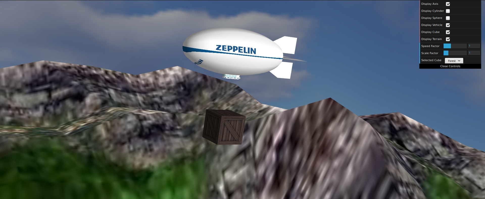
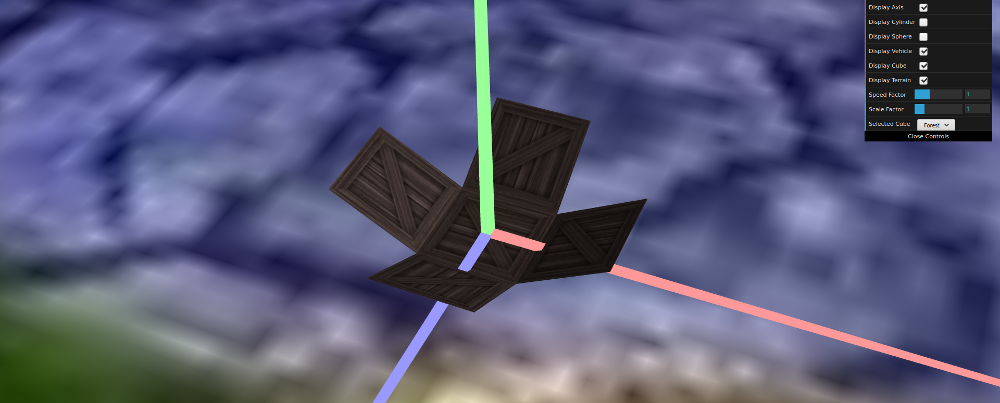
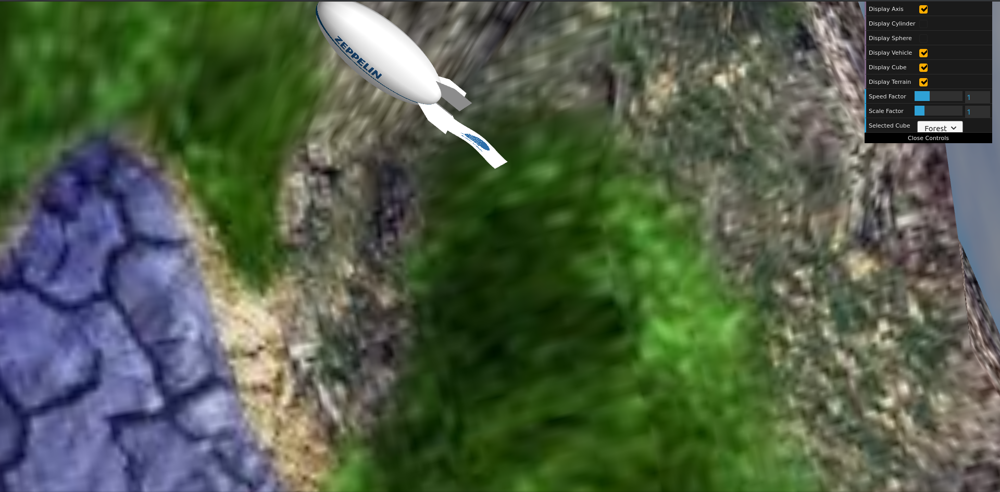
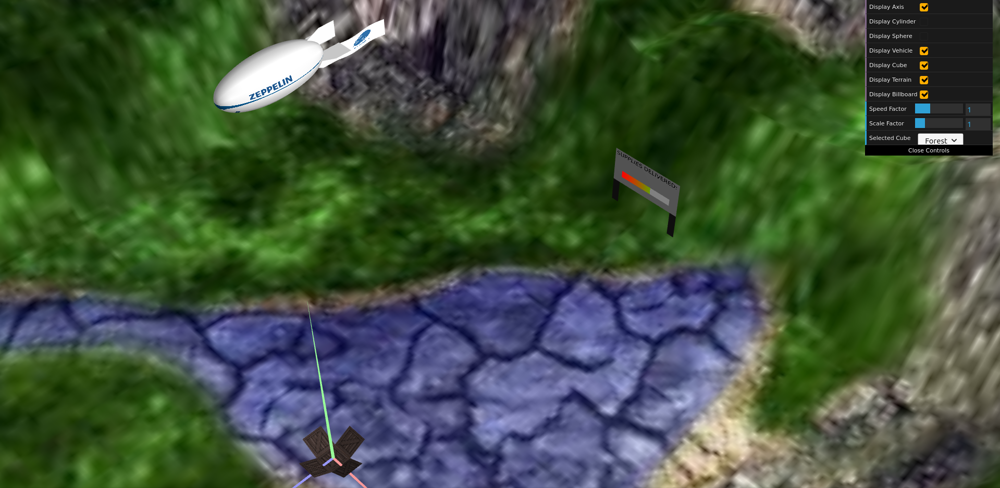
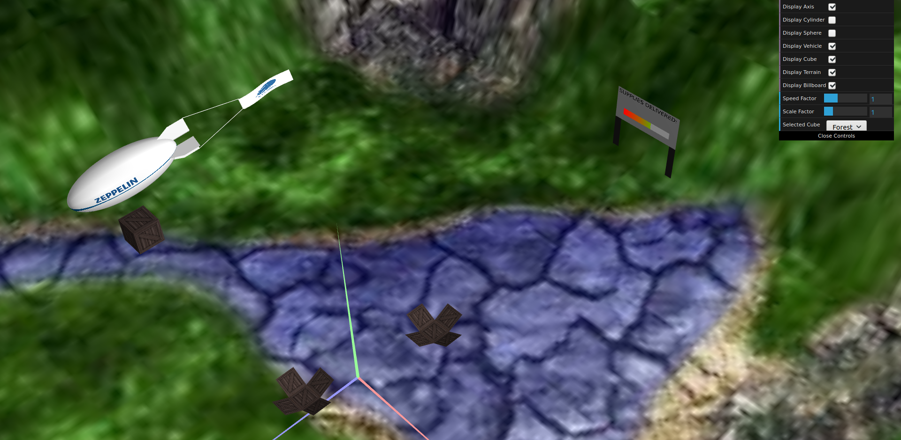
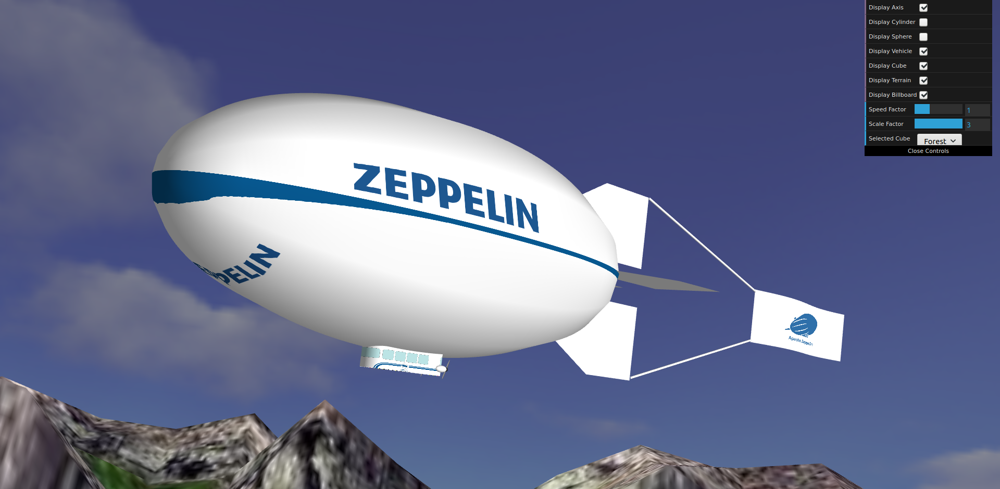
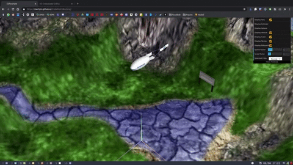

# CGRA project

[**Play**](https://mechjm.github.io/trabalhoCGRA/proj/)

- **Project name:** CGRA project
- **Short description:** Graphic game where you control an airship
- **Environment:** Browser
- **Tools:** Javascript, WebGL
- **Institution:** [FEUP](https://sigarra.up.pt/feup/en/web_page.Inicial)
- **Course:** [CGRA](https://sigarra.up.pt/feup/en/UCURR_GERAL.FICHA_UC_VIEW?pv_ocorrencia_id=436438) (Computer Graphics)
<!-- - **Project grade:** ??/20.0 -->
- **Group members:**
    - [Diogo Miguel Ferreira Rodrigues](https://github.com/dmfrodrigues) ([dmfrodrigues2000@gmail.com](mailto:dmfrodrigues2000@gmail.com)/[diogo.rodrigues@fe.up.pt](mailto:diogo.rodrigues@fe.up.pt))
    - [João Matos](https://github.com/MechJM) ([up201703884@fe.up.pt](mailto:up201703884@fe.up.pt))

## Media

| 📷 (1)                                                 | 📷 (2)                                                 |
|--------------------------------------------------------|--------------------------------------------------------|
|  |  |

| 📷 (3)                                                 | 📷 (4)                                                 |
|--------------------------------------------------------|--------------------------------------------------------|
|  |  |

| 📷 (5)                                                 | 📷 (6)                                                 |
|--------------------------------------------------------|--------------------------------------------------------|
|  |  |

## Portefolio

| 📷 (1)                                                                       | 📷 (2)                                                                       |
|------------------------------------------------------------------------------|------------------------------------------------------------------------------|
|  |  |

| 🎥 (1)                                                                                                                                                      |
|-------------------------------------------------------------------------------------------------------------------------------------------------------------|
|                                                                                                              |

## Controls
- `W`/`S` to propell forward/backwards
- `A`/`D` to turn the rudders to the left/right, making the airship turn to the left/right
- `P` to turn on autopilot (flies in a circle)
- `R` to turn off autopilot (goes back to initial position with no speed)
- `L` to drop supply (up to 5 supplies)
- `↑`/`↓` to raise/lower the elevators, making the airship turn up/down
- `C` to change views:
    - Distant camera
    - Airship camera with fixed horizon
    - Airship closeup pointing forward

## Extra features
- [x] The airship can turn up/down (limited to a pith of ±20°)
- [x] Supplies fall according to classical laws of gravitational physics
- [x] Supplies are subject to linear drag
- [x] The airship is subject to linear drag
- [x] Change cameras
